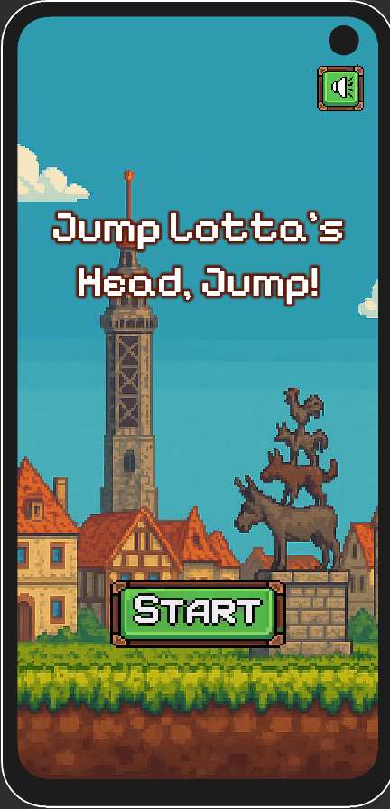
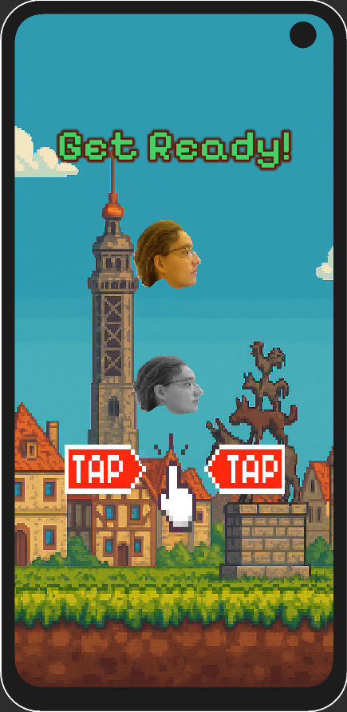
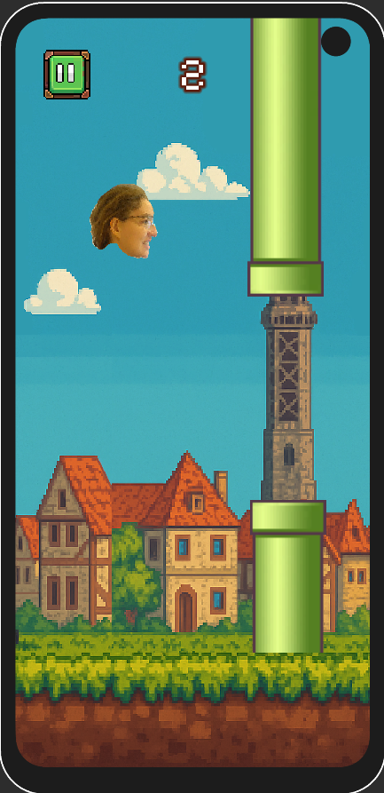
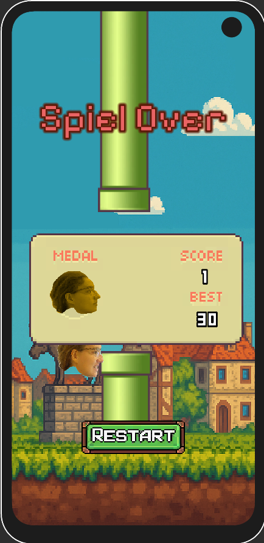

# Jump Lotta's Head, Jump 🐤🎮

A fun and minimalistic **Flappy Bird clone** for Android, built to explore game mechanics, object pooling, di and Unity basics during my training as a Software Developer.

---

## 📱 Platform

- Android (built with Unity)
- Touch controls optimized for mobile play

---

## 🎯 Goal

Navigate through obstacles by tapping the screen to make the character "Lotta's head" jump and stay in the air — just like in the classic Flappy Bird, but with personal flair and character.

---

## 🛠️ Technologies & Features

- Unity Engine (C#)
- Object pooling for performance
- Basic physics-based movement
- Score tracking
- Endless loop mechanics
- Custom sprites and character

---

## 📦 Project Structure

```
/Assets
  /Scripts           → Game logic (movement, pooling, scoring)
  /Prefabs           → Reusable game objects
  /Scenes            → Main game scene
  /Animations        → Simple animations 
  /UI                → Score and game over screen
```

---

## 📲 Installation

To run the game on Android:

1. Clone the repository and open in Unity
2. Switch platform to **Android**
3. Build the APK via `File > Build Settings > Build`
4. Install the APK on your Android device

> Unity version used: `6000.x` *(adjust as needed)*

---

## 📸 Screenshots

  



---

## 🧑‍💻 Author

**Yevgen Panych** – Umschüler zum Fachinformatiker AE

📫 [LinkedIn](https://www.linkedin.com/in/yevgen-panych)  
🌐 [Portfolio](https://panych.site)
